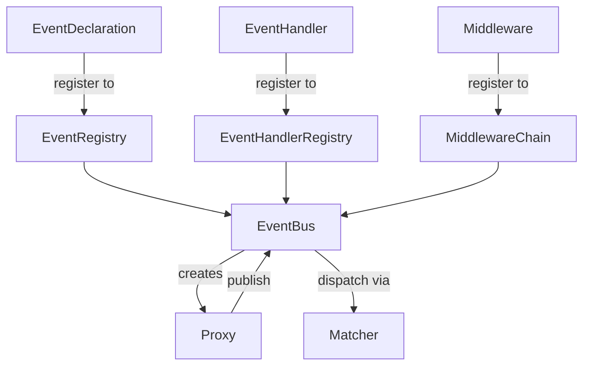

# EventBus — Async Event Bus

## Overview

EventBus is a lightweight, asyncio-based event bus implementing publish/subscribe patterns
to decouple communication between components in async applications. It provides
strongly-typed event declarations, regex-based subscriptions, middleware pipelines,
concurrency control, timeout protection, and graceful shutdown.

---

## Document Index

| Document | Contents |
| - | - |
| [bus.md](bus.md) | `EventBus` core, `Proxy`, `ShutdownConfig`, built-in events & exceptions |
| [event.md](event.md) | `Event` runtime instance, `EventDeclaration`, `EventRegistry` |
| [handler.md](handler.md) | `EventHandler` base class, `EventHandlerRegistry` |
| [matcher.md](matcher.md) | `Matcher` dispatch table, version-aware caching |
| [middleware.md](middleware.md) | `Middleware` base class, `MiddlewareChain`, onion model |
| [templates/](templates/templates.md) | Advanced templates: `expect`, `request`, `pipe`, `register` & built-in middlewares |

---

## Core Component Relationships



### Publish Flow

```text
bus.proxy(source).publish(name, data)
  │
  ▼
before_publish chain (Middleware 1 → 2 → ... → core)
  │
  ├─ validate EventDeclaration
  ├─ validate payload (Pydantic)
  ├─ construct Event
  └─ enqueue → trigger on_publish chain
       │
       ▼
    dispatch loop
       │
       ├─ Matcher.match(name)
       └─ create_task(handler_wrapper)
            ├─ semaphore (concurrency limit)
            ├─ asyncio.timeout
            └─ handler(bus, event)
```

## Quick Example

```python
import asyncio
from pydantic import BaseModel
from event_bus import (
    EventBus, EventDeclaration, EventHandler,
    EventRegistry, EventHandlerRegistry,
)

# 1. Declare payload
class OrderPayload(BaseModel):
    order_id: str

# 2. Declare event
class OrderCreated(EventDeclaration):
    name = "order.created"
    payload_type = OrderPayload

# 3. Define handler
class OrderHandler(EventHandler):
    def __init__(self):
        super().__init__(["order.created"])

    async def handle(self, payload, bus_proxy, raw_event):
        print(f"Processing order: {payload.order_id}")

# 4. Wire up
events = EventRegistry()
events.register(OrderCreated)
handlers = EventHandlerRegistry()
handlers.register(OrderHandler())

# 5. Run
bus = EventBus(events, handlers)
async with bus:
    await bus.proxy("order_svc").publish(
        "order.created", {"order_id": "abc-123"}
    )
```

---

## Workflow

1. **Event Declaration & Registration** — Define event types and register them in
   `EventRegistry`, enabling the bus to recognize valid events and their payload structures.
2. **Handler Subscription & Registration** — Implement `EventHandler` and declare
   listened event patterns via `subscriptions` (supports regex), registering into
   `EventHandlerRegistry`.
3. **Bus Startup & Publishing** — Publish events via `EventBus.Proxy.publish()`, which
   automatically performs payload validation, middleware pipeline processing, and enqueuing.
4. **Event Dispatch & Handling** — The dispatch loop dequeues events, matches subscribed
   handlers, and controls concurrent execution via a semaphore.
5. **Graceful Shutdown** — Publish `__shutdown__` notification → reject new publishes →
   drain queue → wait for active tasks to complete.

---

## Key Features

- **Strongly-Typed Payload Validation**: Automatically validates data types and structure
  on publish, preventing invalid data from entering the system.
- **Regex-Based Subscriptions**: Supports flexible event name matching rules.
- **Middleware Pipeline**: Onion-model responsibility chain for cross-cutting concerns
  such as logging, validation, and rate limiting.
- **Backpressure Control**: Limits system load via queue size and concurrency semaphore.
- **Timeout Protection**: Each handler can independently set a timeout to prevent a
  single task from blocking the bus.
- **Error Isolation**: A single handler exception does not affect other handlers;
  error information is reported uniformly via built-in error events.
- **Graceful Shutdown**: Ensures all enqueued events are fully processed during shutdown
  to prevent data loss.
- **Observability**: Provides monitoring metrics such as active task count and queue length.

---

## Built-in Events

| Event Name | Trigger | Payload Type | Purpose |
| - | - | - | - |
| `event_bus.__shutdown__` | When the bus begins stopping | None | Notify handlers to perform cleanup |
| `event_bus.__task_error__` | When a handler execution fails | `TaskErrorPayload` | Error monitoring and alerting |

---

## Notes

- All `EventHandler.handle` implementations **must not contain blocking operations**;
  always use async I/O.
- Event payload models should inherit from `pydantic.BaseModel` to ensure data validation.
- Handlers can publish new events via `bus_proxy.publish` to form processing chains;
  the bus automatically tracks sources.
- Publishing new events during shutdown will raise `BusShuttingDown`; callers should
  handle this appropriately.
