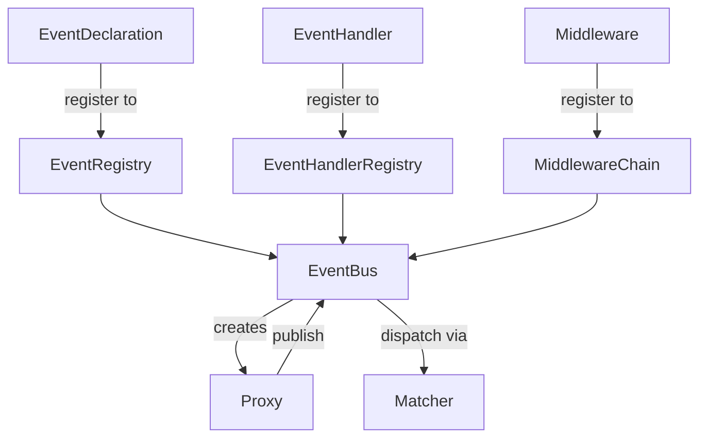

# EventBus — Async Event Bus

## Overview

EventBus is a lightweight, asyncio-based event bus implementing publish/subscribe patterns
to decouple communication between components in async applications. It provides
strongly-typed event declarations, regex-based subscriptions, middleware pipelines,
concurrency control, timeout protection, and graceful shutdown.

---

## Document Index

| Document | Contents |
| - | - |
| [bus.md](bus.md) | `EventBus` core, `Proxy`, `ShutdownConfig`, built-in events & exceptions |
| [event.md](event.md) | `Event` runtime instance, `EventDeclaration`, `EventRegistry` |
| [handler.md](handler.md) | `EventHandler` base class, `EventHandlerRegistry` |
| [matcher.md](matcher.md) | `Matcher` dispatch table, version-aware caching |
| [middleware.md](middleware.md) | `Middleware` base class, `MiddlewareChain`, onion model |
| [templates/](templates/templates.md) | Advanced templates: `expect`, `request`, `pipe`, `register` & built-in middlewares |

---

## Core Component Relationships



### Publish Flow

```text
bus.proxy(source).publish(name, data)
  │
  ▼
before_publish chain (Middleware 1 → 2 → ... → core)
  │
  ├─ validate EventDeclaration
  ├─ validate payload (Pydantic)
  ├─ construct Event
  └─ enqueue → trigger on_publish chain
       │
       ▼
    dispatch loop
       │
       ├─ Matcher.match(name)
       └─ create_task(handler_wrapper)
            ├─ semaphore (concurrency limit)
            ├─ asyncio.timeout
            └─ handler(bus_proxy, event)
```

## Quick Example

```python
from pydantic import BaseModel
from event_bus import (
    EventBus, EventDeclaration, EventHandler,
    EventRegistry, EventHandlerRegistry,
)

# 1. Declare payload
class OrderPayload(BaseModel):
    order_id: str

# 2. Declare event
class OrderCreated(EventDeclaration):
    name = "order.created"
    payload_type = OrderPayload

# 3. Define handler
class OrderHandler(EventHandler):
    def __init__(self):
        super().__init__(["order.created"])

    async def handle(self, payload, bus_proxy, raw_event):
        print(f"Processing order: {payload.order_id}")

# 4. Wire up
events = EventRegistry()
events.register(OrderCreated)
handlers = EventHandlerRegistry()
handlers.register(OrderHandler())

# 5. Run
bus = EventBus(events, handlers)
async with bus:
    await bus.proxy("order_svc").publish(
        "order.created", {"order_id": "abc-123"}
    )
```
