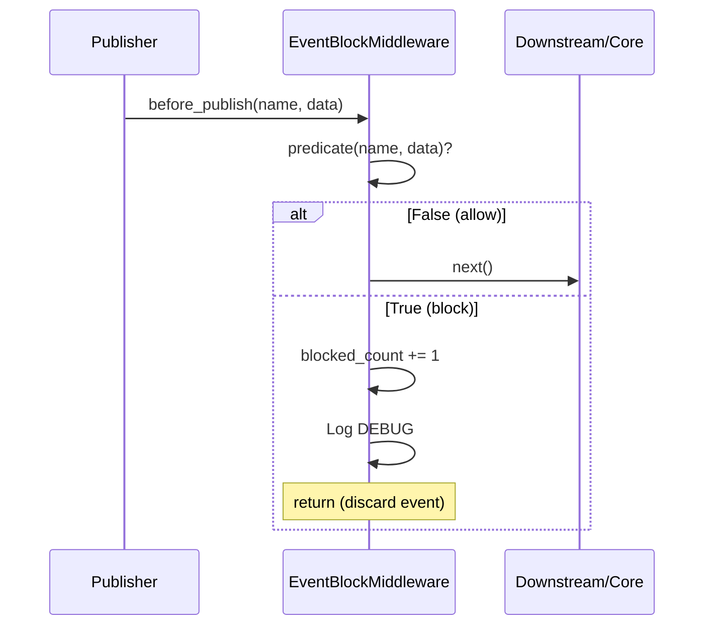

# EventBlockMiddleware — Event Blocking Middleware

## Overview

`EventBlockMiddleware` blocks (discards) specific events during the `before_publish` phase
based on a custom predicate. Blocked events never invoke downstream middleware and are
never enqueued — effectively cutting off the event flow at the very front of the publish
pipeline.

Two factory functions simplify common blocking scenarios:

- `make_blocklist_predicate` — blocklist mode (by event name)
- `make_allowlist_predicate` — allowlist mode (by event name)

---

## Use Cases

- **Feature flags**: Dynamically enable/disable event types via configuration.
- **A/B testing**: Filter events by user group.
- **Environment isolation**: Block external notification events (email, SMS, etc.) in
  development environments.
- **Noise filtering**: Block high-frequency but low-value debug/heartbeat events.
- **Security policies**: Intercept event publishing by data sensitivity level.

---

## Function Signatures

### EventBlockMiddleware

```python
BlockPredicate = Callable[[str, Dict[str, Any] | BaseModel | None], bool]

class EventBlockMiddleware(Middleware):
    def __init__(
        self,
        block_predicate: BlockPredicate,
        *,
        block_reason: str = 'blocked by predicate',
    ) -> None
```

| Parameter | Type | Description |
| - | - | - |
| `block_predicate` | `BlockPredicate` | Predicate function with signature `(name, data) -> bool`. Returns `True` to block the event. |
| `block_reason` | `str` | Reason description included in the log when blocking. Default: `"blocked by predicate"`. |

### Properties

| Property | Type | Description |
| - | - | - |
| `blocked_count` | `int` | Cumulative count of blocked events since middleware creation. |

### make_blocklist_predicate

```python
def make_blocklist_predicate(*event_names: str) -> BlockPredicate
```

| Parameter | Type | Description |
| - | - | - |
| `*event_names` | `str` | Event names to block. |

### make_allowlist_predicate

```python
def make_allowlist_predicate(*event_names: str) -> BlockPredicate
```

| Parameter | Type | Description |
| - | - | - |
| `*event_names` | `str` | Event names to allow. Events not in the list are blocked. |

---

## Workflow



---

## Usage Examples

### Blocklist Mode

Block specific event names:

```python
from event_bus.templates.middlewares import (
    EventBlockMiddleware,
    make_blocklist_predicate,
)

# Block debug events
pred = make_blocklist_predicate("debug.heartbeat", "debug.ping", "debug.metrics")
mw = EventBlockMiddleware(pred, block_reason="debug events disabled in production")
```

### Allowlist Mode

Only allow events in the allowlist:

```python
from event_bus.templates.middlewares import (
    EventBlockMiddleware,
    make_allowlist_predicate,
)

# Only allow user auth events
pred = make_allowlist_predicate("user.login", "user.logout", "user.signup")
mw = EventBlockMiddleware(pred, block_reason="not in allowlist")
```

### Custom Predicate Logic

Dynamically decide to block based on data content:

```python
def block_negative_amount(name: str, data) -> bool:
    """Block events with negative amounts"""
    if isinstance(data, dict):
        return data.get("amount", 0) < 0
    return False

mw = EventBlockMiddleware(block_negative_amount, block_reason="negative amount")
```

### Composing with EventTransformMiddleware

Transform event names first, then block based on the new name:

```python
from event_bus.templates.middlewares import (
    EventBlockMiddleware,
    EventTransformMiddleware,
    make_blocklist_predicate,
    make_rename_transform,
)

chain = MiddlewareChain()
# First transform: old.event → new.event
chain.add(EventTransformMiddleware(
    make_rename_transform({"old.event": "new.event"})
))
# Then block new.event
chain.add(EventBlockMiddleware(
    make_blocklist_predicate("new.event")
))
# Result: publish "old.event" → transforms to "new.event" → blocked
```

---

## Notes

1. **Short-circuit semantics**: Blocked events skip `before_publish` on subsequent
   middleware and never invoke `on_publish`.
2. **Not counted in rate limits**: Blocked events do not consume `RateLimitMiddleware`
   quota (since it comes later in the chain).
3. **Log level**: Block logs are at `DEBUG` level. Configure appropriate log levels in
   production to avoid noise.
4. **Predicates should be side-effect-free**: Predicates may be called multiple times;
   avoid modifying global state inside them.
5. **Allowlist caveat**: `make_allowlist_predicate` blocks **all** unlisted system events
   (e.g., `event_bus.__shutdown__`). Add necessary system events to the allowlist when
   using this mode.

---

## Full Example

See `tests/templates/middlewares/event_block_test.py`

Contains test cases for blocklist, allowlist, custom predicates, and compose-after-transform
scenarios.
