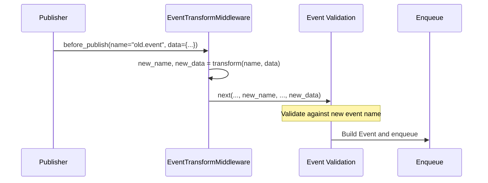

# EventTransformMiddleware — Event Transform Middleware

## Overview

`EventTransformMiddleware` transforms event names and/or payload data during the
`before_publish` phase. By injecting custom transform functions, you can modify event
names or add/remove data fields before the event is enqueued, without downstream handlers
being aware of the original event format.

Three factory functions simplify common transform scenarios:

- `make_rename_transform` — event renaming
- `make_field_inject_transform` — field injection
- `make_field_redact_transform` — field redaction

---

## Use Cases

- **Event renaming**: Map legacy event names to new versions for smooth migration.
- **Data redaction**: Remove sensitive fields (passwords, tokens, etc.) before persistence
  or cross-system transmission.
- **Data enrichment**: Auto-inject common fields (`trace_id`, `timestamp`, `env`).
- **Protocol adaptation**: Convert external system event formats to internal formats.
- **A/B testing**: Route events to different target event names based on conditions.

---

## Function Signatures

### EventTransformMiddleware

```python
TransformFunc = Callable[
    [str, Dict[str, Any] | BaseModel | None],
    tuple[str, Dict[str, Any] | BaseModel | None],
]

class EventTransformMiddleware(Middleware):
    def __init__(self, transform: TransformFunc) -> None
```

| Parameter | Type | Description |
| - | - | - |
| `transform` | `TransformFunc` | Transform function with signature `(name, data) -> (new_name, new_data)`. |

### make_rename_transform

```python
def make_rename_transform(mapping: Dict[str, str]) -> TransformFunc
```

| Parameter | Type | Description |
| - | - | - |
| `mapping` | `Dict[str, str]` | Mapping of old event names → new event names. Unmatched names remain unchanged. |

### make_field_inject_transform

```python
def make_field_inject_transform(**static_fields: Any) -> TransformFunc
```

| Parameter | Type | Description |
| - | - | - |
| `**static_fields` | `Any` | Static key-value pairs to inject. Injected values take precedence over existing fields with the same name. |

> **Note**: Only applies to `dict`-type `data`. `BaseModel` or `None` data is left unchanged.

### make_field_redact_transform

```python
def make_field_redact_transform(
    *fields: str,
    replacement: str = '***',
) -> TransformFunc
```

| Parameter | Type | Description |
| - | - | - |
| `*fields` | `str` | Field names to redact. |
| `replacement` | `str` | Replacement text, default `"***"`. |

---

## Workflow



Key points:

1. Transformation occurs **after** event declaration validation and **before** Event
   construction.
2. The transformed event name must be registered in `EventRegistry`, otherwise subsequent
   validation will fail.
3. Transform functions **should not raise exceptions**. Handle edge cases internally if
   conditional transforms are needed.

---

## Usage Examples

### Event Renaming

```python
from event_bus.templates.middlewares import (
    EventTransformMiddleware,
    make_rename_transform,
)

transform = make_rename_transform({
    "user.created.v1": "user.created",
    "order.placed.v1": "order.placed",
})
mw = EventTransformMiddleware(transform)
```

### Field Injection

```python
from event_bus.templates.middlewares import (
    EventTransformMiddleware,
    make_field_inject_transform,
)

# Auto-inject trace_id and environment identifier for all events
transform = make_field_inject_transform(
    trace_id="abc-123",
    env="production",
    version="2.0.0",
)
mw = EventTransformMiddleware(transform)
```

Publishing `{"user_id": 42}` → actual payload becomes
`{"trace_id": "abc-123", "env": "production", "version": "2.0.0", "user_id": 42}`.

### Field Redaction

```python
from event_bus.templates.middlewares import (
    EventTransformMiddleware,
    make_field_redact_transform,
)

# Auto-redact sensitive fields
transform = make_field_redact_transform("password", "token", "secret")
mw = EventTransformMiddleware(transform)
```

Publishing `{"username": "alice", "password": "s3cret!"}` → actual payload becomes
`{"username": "alice", "password": "***"}`.

### Custom Transform Function

```python
def add_prefix(name: str, data) -> tuple:
    # Don't add prefix to system events
    if name.startswith("event_bus."):
        return name, data
    return f"prefix.{name}", data

mw = EventTransformMiddleware(add_prefix)
```

---

## Notes

1. **Target event must be registered**: The transformed event name must exist in
   `EventRegistry`, otherwise publishing fails with an undeclared event error.
2. **Transform order**: Multiple transform middlewares execute sequentially in registration
   order; later transforms operate on the results of earlier ones.
3. **Field injection only applies to dict**: `make_field_inject_transform` and
   `make_field_redact_transform` only handle `dict` payloads. For `BaseModel` instances,
   write a custom transform function.
4. **Idempotency**: Ensure transform functions produce consistent results for the same
   input to avoid unintended side effects.
5. **Composing with EventBlockMiddleware**: After transforming, you can chain with
   `EventBlockMiddleware` to filter by the new event name (see `event_block.md`).

---

## Full Example

See `tests/templates/middlewares/event_transform_test.py`

Contains test cases for event renaming, field injection, field redaction, and custom
transforms.
