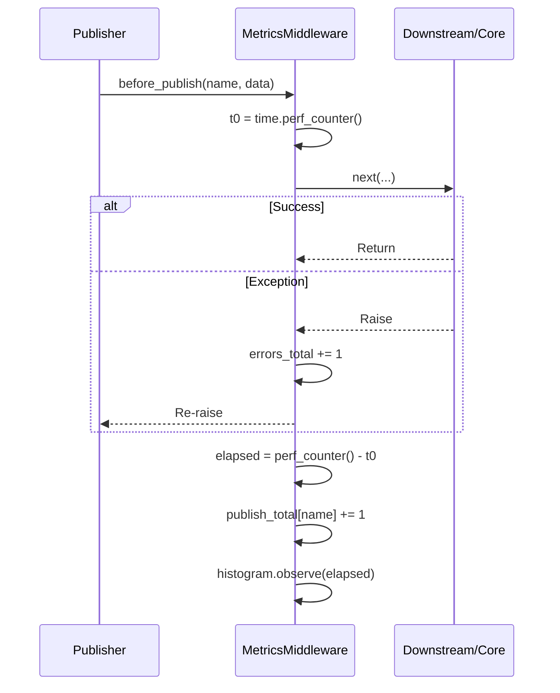

# MetricsMiddleware — Metrics Reporting Middleware

## Overview

`MetricsMiddleware` is a **zero-dependency**, lightweight metrics collection middleware
providing Prometheus / OpenTelemetry-style instrumentation. Pure in-memory implementation
— no need to install `prometheus_client` or `opentelemetry-api`.

Get a read-only snapshot via `snapshot()`, or bridge to the official SDKs with a single
call to `integrate_prometheus()` / `integrate_opentelemetry()` to expose metrics to
Prometheus scrape endpoints or OTLP Collectors.

---

## Collected Metrics

| Metric Name | Type | Description |
| - | - | - |
| `event_bus_publish_total` | Counter | Publish count by event name (including failed attempts) |
| `event_bus_publish_duration` | Histogram | Publish latency (before_publish → end of on_publish) |
| `event_bus_publish_errors_total` | Counter | Publish failure count |
| `event_bus_queue_size` | Gauge | Current event queue depth |
| `event_bus_active_tasks` | Gauge | Current active handler task count |

---

## Use Cases

- **Observability**: Monitor event bus throughput, latency, and error rates.
- **Performance analysis**: Identify slow events or handlers via latency histograms.
- **Capacity planning**: Observe queue depth and active tasks to assess scaling needs.
- **Alerting**: Integrate with Prometheus + Grafana or OpenTelemetry + Jaeger for alerts.
- **Debugging**: Quickly inspect bus runtime state via `snapshot()` during development.

---

## Function Signature

### MetricsMiddleware

```python
class MetricsMiddleware(Middleware):
    def __init__(self, histogram_bounds: tuple[float, ...] = _DEFAULT_BUCKETS) -> None
```

| Parameter | Type | Description |
| - | - | - |
| `histogram_bounds` | `tuple[float, ...]` | Histogram bucket upper bounds in seconds. Default covers 1ms–30s: `(0.001, 0.005, 0.01, 0.025, 0.05, 0.1, 0.25, 0.5, 1.0, 2.5, 5.0, 10.0, 30.0)`. |

### Methods

| Method | Description |
| - | - |
| `snapshot() -> MetricsSnapshot` | Returns a read-only snapshot of all current metrics. |
| `integrate_prometheus(registry=None)` | Bridges to the `prometheus_client` SDK. After calling, metrics are synced to official Counter / Histogram / Gauge. |
| `integrate_opentelemetry(meter=None)` | Bridges to the `opentelemetry-api` SDK. After calling, metrics are synced to OTel Counter / Histogram / Gauge. |

### Properties

| Property | Type | Description |
| - | - | - |
| `prometheus_integrated` | `bool` | Whether bridged to `prometheus_client`. |
| `opentelemetry_integrated` | `bool` | Whether bridged to `opentelemetry-api`. |

---

## Data Models

### MetricsSnapshot

```python
class MetricsSnapshot(BaseModel):
    publish_total: Dict[str, int]           # {event_name: publish count}
    publish_duration_sec: Dict[str, Buckets] # {event_name: latency histogram}
    publish_errors_total: int               # Total publish failures
    queue_size: int                         # Current queue depth
    active_tasks: int                       # Current active handler tasks
```

### Buckets

```python
class Buckets(BaseModel):
    count: int                # Total observations
    sum: float                # Sum of observed values (seconds)
    buckets: Dict[str, int]   # {upper_bound_string: count}
    inf: int                  # Samples exceeding the largest bucket bound
```

---

## Workflow



Key points:

1. Timing starts on `before_publish` entry and ends after the core publish flow (including
   `on_publish` chain), covering the complete publish latency.
2. Failed publishes count toward **both** `publish_total` and `publish_errors_total`
   (following the Prometheus `_total` convention).
3. `queue_size` and `active_tasks` are instantaneous values, retrieved via `snapshot()` or
   Gauge callbacks.

---

## Usage Examples

### Pure In-Memory Mode

```python
from event_bus.templates.middlewares import MetricsMiddleware
from event_bus import MiddlewareChain

metrics = MetricsMiddleware()
chain = MiddlewareChain()
chain.add(metrics)

bus = EventBus(events, handlers, middleware_chain=chain)
async with bus:
    await bus.proxy("svc").publish("order.created", {...})
    await bus.proxy("svc").publish("order.paid", {...})

# Get snapshot
snap = metrics.snapshot()
print(snap.publish_total)
# {'order.created': 1, 'order.paid': 1}

print(snap.publish_duration_sec["order.created"])
# Buckets(count=1, sum=0.0032, buckets={'0.001': 0, '0.005': 1, ...}, inf=0)
```

### Integrating with Prometheus SDK

```python
import prometheus_client

metrics = MetricsMiddleware()

# Bridge to a custom Registry (omit to use the global REGISTRY)
registry = prometheus_client.CollectorRegistry()
metrics.integrate_prometheus(registry)

# Start HTTP exposition endpoint
prometheus_client.start_http_server(8000, registry=registry)

# Metrics are now synced to official Counter / Histogram / Gauge
# Visit http://localhost:8000/metrics to scrape
```

### Integrating with OpenTelemetry SDK

```python
from opentelemetry import metrics as otel_metrics
from opentelemetry.sdk.metrics import MeterProvider
from opentelemetry.sdk.metrics.export import (
    ConsoleMetricExporter,
    PeriodicExportingMetricReader,
)

# Configure OTel SDK
reader = PeriodicExportingMetricReader(ConsoleMetricExporter())
provider = MeterProvider(metric_readers=[reader])
otel_metrics.set_meter_provider(provider)

meter = otel_metrics.get_meter("event_bus")

metrics = MetricsMiddleware()
metrics.integrate_opentelemetry(meter)

# Metrics are exported via OTLP exporter to Collector / Jaeger / Prometheus
```

### Custom Bucket Boundaries

```python
# Custom latency buckets: 10ms, 50ms, 100ms, 500ms, 1s, 5s
metrics = MetricsMiddleware(histogram_bounds=(0.01, 0.05, 0.1, 0.5, 1.0, 5.0))
```

### Composing with Other Middlewares

```python
from event_bus.templates.middlewares import (
    MetricsMiddleware,
    RateLimitMiddleware,
    JSONLLoggingMiddleware,
)

chain = MiddlewareChain()
chain.add(RateLimitMiddleware(max_requests=100, window_seconds=1.0))
chain.add(metrics := MetricsMiddleware())
chain.add(JSONLLoggingMiddleware("events.jsonl"))

# Execution order: rate limit → metrics collection → logging
# Metrics will record rate-limited rejected events (counted in publish_total + errors_total)
```

---

## Notes

1. **Zero-dependency by default**: Without `prometheus_client` / `opentelemetry-api`, pure
   in-memory mode works fully; `snapshot()` functions normally.
2. **Lazy bridging**: The corresponding SDK is only imported when `integrate_prometheus()`
   / `integrate_opentelemetry()` is called.
3. **publish_total includes failures**: Following the Prometheus `_total` convention, all
   publish attempts (including failures) are counted in `publish_total`; failures are
   additionally counted in `publish_errors_total`.
4. **Gauges use callbacks**: `queue_size` and `active_tasks` are collected via the SDK's
   callback / `set_function` mechanism, reading the latest value on each scrape.
5. **Idempotent bridging**: Repeated calls to `integrate_*` methods do not create
   duplicate metrics.
6. **Snapshot is read-only**: `snapshot()` returns a deep copy of `MetricsSnapshot`;
   modifications do not affect internal state.

---

## Internals

- Pure in-memory histogram `_Histogram`: cumulative bucketing, no external dependencies.
- Timing uses `time.perf_counter()`, a high-precision monotonic clock.
- `try...finally` in `before_publish` ensures latency and error counts are recorded even
  in exception scenarios.
- Prometheus Gauges use `set_function` for lazy evaluation.
- OpenTelemetry Gauges use `create_observable_gauge` + callback for lazy evaluation.

---

## Full Example

See `tests/templates/middlewares/metrics_test.py`

Contains test cases for basic counting, latency histograms, per-event independent counters,
error counting, snapshot immutability, custom bucket boundaries, and Prometheus SDK
bridging.
