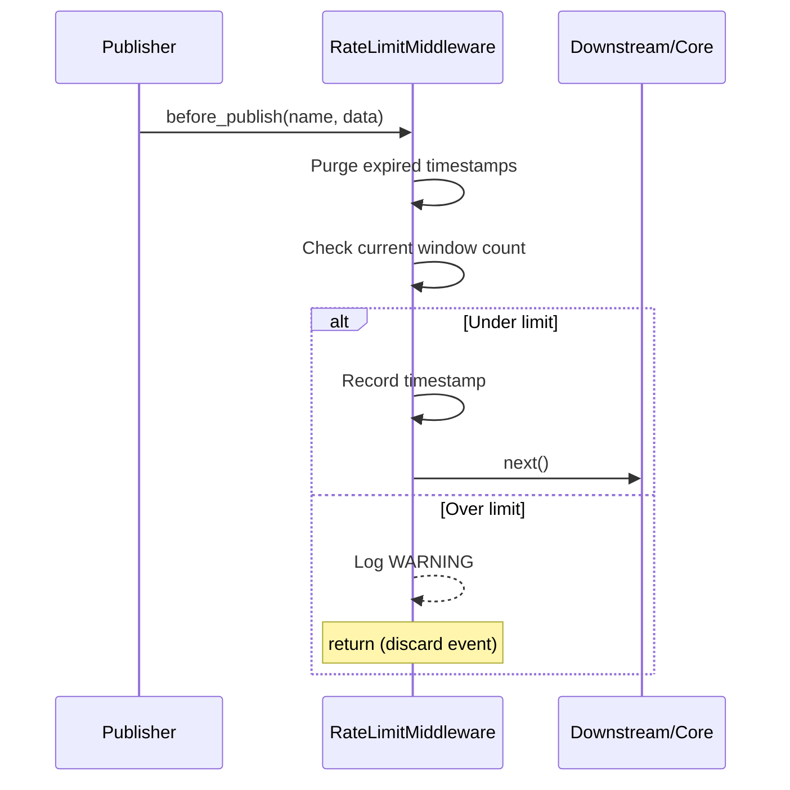

# RateLimitMiddleware — Rate Limiting Middleware

## Overview

`RateLimitMiddleware` is a **sliding-window** based rate limiting middleware. It controls
event publishing frequency during the `before_publish` phase, automatically discarding
events that exceed the limit (without calling `next`) and logging a warning.

Two rate limiting modes are supported:

- **Global limiting** (`per_event=False`): All events share a single window.
- **Per-event limiting** (`per_event=True`): Each event name counts independently.

Pure in-memory implementation with no external dependencies.

---

## Use Cases

- **Anti-abuse protection**: Limit high-frequency event publishing from clients.
- **Resource protection**: Prevent downstream handlers from being overwhelmed by traffic
  bursts.
- **Degradation strategy**: Automatically drop non-critical events under high system load.
- **Test control**: Precisely control event flow rates in test environments.

---

## Function Signature

```python
class RateLimitMiddleware(Middleware):
    def __init__(
        self,
        max_requests: int = 100,
        window_seconds: float = 1.0,
        per_event: bool = False,
    ) -> None
```

| Parameter | Type | Description |
| - | - | - |
| `max_requests` | `int` | Maximum allowed requests within the time window. Default `100`. |
| `window_seconds` | `float` | Sliding window size in seconds. Default `1.0`. |
| `per_event` | `bool` | If `True`, count independently per event name; otherwise share a single global window. Default `False`. |

### Properties

| Property | Type | Description |
| - | - | - |
| `current_rate` | `Dict[str, int]` | Returns a snapshot of current request counts per window. Key is the event name (or `"__global__"`), value is the count in the current window. |

---

## Workflow



1. On `before_publish`, timestamps outside the window (earlier than `now - window_seconds`)
   are purged first.
2. Check whether requests in the current window ≥ `max_requests`.
3. If under limit: record the current timestamp, call `next` to continue the publish flow.
4. If over limit: log a `WARNING`, return directly (skip `next`), event is discarded.

---

## Usage Examples

### Global Limiting

All events share a limit of 100 per second:

```python
from event_bus.templates.middlewares import RateLimitMiddleware
from event_bus import MiddlewareChain

mw = RateLimitMiddleware(max_requests=100, window_seconds=1.0)
chain = MiddlewareChain()
chain.add(mw)
```

### Per-Event Limiting

Each event name counts independently:

```python
# mw.ping max 50/sec, user.login max 10/sec (each independently)
mw = RateLimitMiddleware(
    max_requests=50,
    window_seconds=1.0,
    per_event=True,
)
```

### Query Current Rate

```python
# View current request counts per window
print(mw.current_rate)
# Example output: {'__global__': 42} or {'mw.ping': 5, 'user.login': 2}
```

### Composing with Other Middlewares

Rate-limit first, then transform — ensuring transforms only apply to events that pass
the rate limit:

```python
from event_bus.templates.middlewares import (
    RateLimitMiddleware,
    EventTransformMiddleware,
    make_field_inject_transform,
)

chain = MiddlewareChain()
chain.add(RateLimitMiddleware(max_requests=10, window_seconds=1.0))
chain.add(EventTransformMiddleware(
    make_field_inject_transform(source="trusted")
))
# Execution order: rate limit → inject field → core publish
```

---

## Notes

1. **Silent discard**: Rate-limited events are silently dropped with no exception raised.
   To detect discards, monitor logs or implement a custom middleware.
2. **Window precision**: Based on `time.monotonic()`, unaffected by system clock adjustments.
3. **Concurrency safety**: Counting operations are protected by `asyncio.Lock`.
4. **Memory footprint**: Each window retains at most `max_requests` timestamps; memory
   overhead is manageable.
5. **No `on_publish_error`**: Rate limiting occurs before enqueueing and does not trigger
   the error hook.

---

## Full Example

See `tests/templates/middlewares/rate_limit_test.py`

Contains test cases for global limiting, per-event limiting, and compose-with-transform
after rate limiting scenarios.
