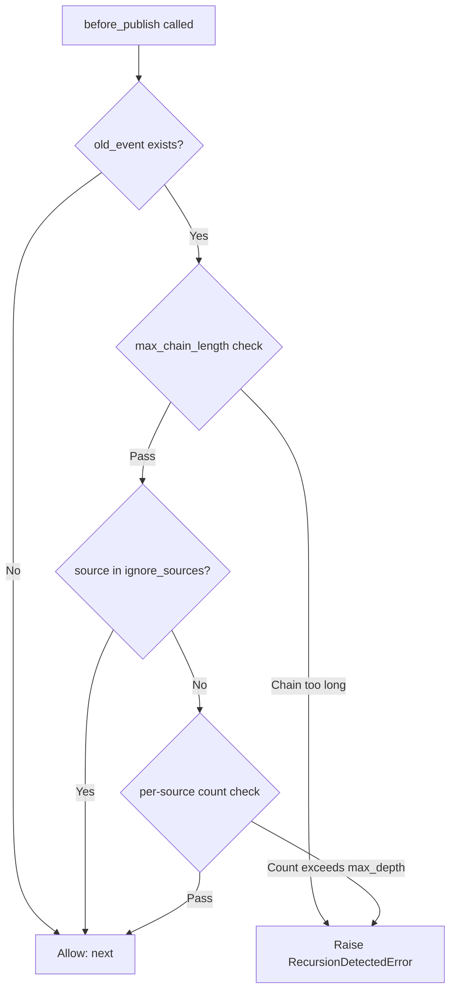

# RecursionGuardMiddleware — Recursion Guard Middleware

## Overview

`RecursionGuardMiddleware` provides a **dual-layer detection** mechanism to prevent
infinite recursion in event publishing (including self-recursion and mutual recursion).
All detection happens during the `before_publish` phase, intercepting before enqueueing
to avoid consuming queue resources.

When recursion is detected, a `RecursionDetectedError` (extends `RuntimeError`) is raised,
which triggers the `on_publish_error` notification across all middlewares in the chain.

---

## Use Cases

- **Self-recursion guard**: Handler A publishes an event with the same name while
  processing, causing itself to be called repeatedly.
- **Mutual recursion guard**: Handler A publishes an event triggering Handler B, which
  publishes an event triggering Handler A, forming a cycle.
- **Chain length protection**: Limit the maximum event chain length to prevent unbounded
  growth due to abnormal business logic.

---

## Function Signatures

### RecursionGuardMiddleware

```python
class RecursionGuardMiddleware(Middleware):
    def __init__(
        self,
        max_depth: int = 3,
        max_chain_length: Optional[int] = 50,
        ignore_sources: Optional[Set[str]] = None,
    ) -> None
```

| Parameter | Type | Description |
| - | - | - |
| `max_depth` | `int` | Maximum times the same `source` may appear in the event chain's `sources`. Default `3`. |
| `max_chain_length` | `Optional[int]` | Absolute maximum event chain length. Default `50`. Set to `None` to disable this check. |
| `ignore_sources` | `Optional[Set[str]]` | Publisher names excluded from per-source counting. Does not affect absolute chain length checks. |

### RecursionDetectedError

```python
class RecursionDetectedError(RuntimeError):
    """Event publish recursion detected and intercepted."""
```

---

## Dual-Layer Detection



### Layer 1: Per-Source Counting

Rejects when the same `source` appears ≥ `max_depth` times in the event chain's `sources`
list.

**Example**:

```text
root(test) → Handler A publish(system) → Handler B publish(system) → Handler A publish(system) ❌ intercepted
```

`system` appears 3 times in `sources` (default `max_depth=3`); the 4th publish is
intercepted before execution.

### Layer 2: Absolute Chain Length

Rejects when the event chain `event_ids` length > `max_chain_length`, regardless of
per-source counts.

**Example**: With `max_depth=3`, K modules can mutually recurse for `3 × K` rounds.
Setting `max_chain_length=10` can intercept sooner in such scenarios.

---

## Usage Examples

### Basic Guard

```python
from event_bus.templates.middlewares import RecursionGuardMiddleware
from event_bus import MiddlewareChain

# Default config: same source max 3 appearances, chain max 50
mw = RecursionGuardMiddleware()
chain = MiddlewareChain()
chain.add(mw)
```

### Strict Mode

```python
# Stricter limits: same source max 2 appearances, chain max 10
mw = RecursionGuardMiddleware(max_depth=2, max_chain_length=10)
```

### Ignoring Specific Sources

```python
# Certain middlewares or system components may appear multiple times in the chain
mw = RecursionGuardMiddleware(
    max_depth=3,
    ignore_sources={"LoggingMiddleware", "MetricsCollector"},
)
```

Ignored sources don't participate in per-source counting but are still subject to
absolute chain length limits.

### Chain-Length-Only Detection

```python
# Disable per-source detection, rely only on chain length
mw = RecursionGuardMiddleware(
    max_depth=0,            # Allow unlimited same-source appearances
    max_chain_length=20,    # But intercept when chain exceeds 20
)
```

### Per-Source-Only Detection

```python
# Disable chain length detection, rely only on per-source counting
mw = RecursionGuardMiddleware(
    max_depth=2,
    max_chain_length=None,  # Disable absolute chain length check
)
```

---

## Recursion Scenarios in Detail

### Self-Recursion

```text
Handler X subscribes to "order.updated"
  → publishes "order.updated" while processing
    → Handler X called again
      → publishes "order.updated" again ...
```

With `max_depth=2`, this is intercepted before the 3rd publish.

### Mutual Recursion

```text
Handler A subscribes to "event.a" → publishes "event.b" while processing
Handler B subscribes to "event.b" → publishes "event.a" while processing
```

Per-source counts are 2 each — no interception from depth check. But the chain length
grows continuously; `max_chain_length` intercepts after a certain number of rounds.

### Chain Passing (Normal Scenario)

```text
Service A publishes "data.received"
  → Service B processes and publishes "data.validated"
    → Service C processes and publishes "data.stored"
```

Three different sources, per-source counts are 1 each, chain length = 3 — passes normally.

---

## Notes

1. **Root event exemption**: Root events where `old_event` is `None` are always allowed
   through; no checks are performed.
2. **`ignore_sources` only affects layer 1**: Ignored sources are still subject to the
   absolute chain length check.
3. **Exception propagation**: `RecursionDetectedError` interrupts the current publish flow
   and notifies all middlewares via `on_publish_error`.
4. **Performance**: Detection involves only list traversal and counting; O(n) time
   complexity where n is the current chain length.
5. **Defaults**: `max_depth=3` and `max_chain_length=50` suit most scenarios. Overly
   strict settings may falsely reject normal chain calls.

---

## Full Example

See `tests/templates/middlewares/recursion_guard_test.py`

Contains test cases for normal chain publishing, recursion interception, root event
exemption, ignored sources, independent source counting, and absolute chain length limits.
