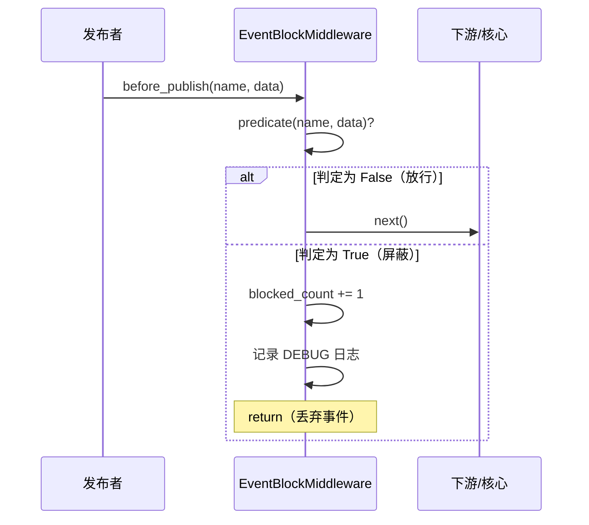

# EventBlockMiddleware 事件屏蔽中间件文档

## 概述

`EventBlockMiddleware` 根据自定义判定规则在 `before_publish` 阶段屏蔽（丢弃）特定事件。被屏蔽的事件不会调用下游中间件，也不会入队——相当于在发布流程的最前端截断了事件流。

框架提供了两个工厂函数简化常见屏蔽场景：

- `make_blocklist_predicate` — 基于事件名的黑名单模式
- `make_allowlist_predicate` — 基于事件名的白名单模式

---

## 使用场景

- **功能开关**：通过配置动态开启/关闭某类事件。
- **A/B 测试**：按用户分组过滤事件。
- **环境隔离**：在开发环境中屏蔽外部通知类事件（邮件、短信等）。
- **噪音过滤**：屏蔽高频但无业务价值的调试/心跳事件。
- **安全策略**：按数据敏感级别拦截事件发布。

---

## 函数签名

### EventBlockMiddleware

```python
BlockPredicate = Callable[[str, Dict[str, Any] | BaseModel | None], bool]

class EventBlockMiddleware(Middleware):
    def __init__(
        self,
        block_predicate: BlockPredicate,
        *,
        block_reason: str = 'blocked by predicate',
    ) -> None
```

| 参数 | 类型 | 说明 |
| - | - | - |
| `block_predicate` | `BlockPredicate` | 判定函数，签名为 `(name, data) -> bool`。返回 `True` 表示屏蔽该事件。 |
| `block_reason` | `str` | 屏蔽时日志中包含的原因描述，默认 `"blocked by predicate"`。 |

### 属性

| 属性 | 类型 | 说明 |
| - | - | - |
| `blocked_count` | `int` | 累计已屏蔽事件数（自中间件创建以来）。 |

### make_blocklist_predicate

```python
def make_blocklist_predicate(*event_names: str) -> BlockPredicate
```

| 参数 | 类型 | 说明 |
| - | - | - |
| `*event_names` | `str` | 需要屏蔽的事件名列表。 |

### make_allowlist_predicate

```python
def make_allowlist_predicate(*event_names: str) -> BlockPredicate
```

| 参数 | 类型 | 说明 |
| - | - | - |
| `*event_names` | `str` | 允许通过的事件名列表。不在列表中的事件被屏蔽。 |

---

## 工作流程



---

## 使用示例

### 黑名单模式

屏蔽指定事件名：

```python
from event_bus.templates.middlewares import (
    EventBlockMiddleware,
    make_blocklist_predicate,
)

# 屏蔽调试事件
pred = make_blocklist_predicate("debug.heartbeat", "debug.ping", "debug.metrics")
mw = EventBlockMiddleware(pred, block_reason="debug events disabled in production")
```

### 白名单模式

仅允许白名单中的事件通过：

```python
from event_bus.templates.middlewares import (
    EventBlockMiddleware,
    make_allowlist_predicate,
)

# 仅允许用户认证事件
pred = make_allowlist_predicate("user.login", "user.logout", "user.signup")
mw = EventBlockMiddleware(pred, block_reason="not in allowlist")
```

### 自定义判定逻辑

基于数据内容动态决定是否屏蔽：

```python
def block_negative_amount(name: str, data) -> bool:
    """屏蔽金额为负的事件"""
    if isinstance(data, dict):
        return data.get("amount", 0) < 0
    return False

mw = EventBlockMiddleware(block_negative_amount, block_reason="negative amount")
```

### 与 EventTransformMiddleware 组合

先转换事件名，再基于新名称屏蔽：

```python
from event_bus.templates.middlewares import (
    EventBlockMiddleware,
    EventTransformMiddleware,
    make_blocklist_predicate,
    make_rename_transform,
)

chain = MiddlewareChain()
# 先转换：old.event → new.event
chain.add(EventTransformMiddleware(
    make_rename_transform({"old.event": "new.event"})
))
# 再屏蔽 new.event
chain.add(EventBlockMiddleware(
    make_blocklist_predicate("new.event")
))
# 结果：发布 "old.event" → 转换为 "new.event" → 被屏蔽
```

---

## 注意事项

1. **短路语义**：被屏蔽的事件不会调用后续中间件的 `before_publish`，也不会调用 `on_publish`。
2. **不计入速率**：被屏蔽的事件不消耗 `RateLimitMiddleware` 的配额（因为它在中间件链之后）。
3. **日志级别**：屏蔽日志为 `DEBUG` 级别，生产环境建议配置合适的日志级别避免噪音。
4. **判定函数应无副作用**：判定函数可能被多次调用，避免在内部修改全局状态。
5. **白名单陷阱**：`make_allowlist_predicate` 会屏蔽**所有**未列出的系统事件（如 `event_bus.__shutdown__`），使用时需将必要的系统事件加入白名单。

---

## 完整示例

参见 `tests/templates/middlewares/event_block_test.py`

其中包含了黑名单、白名单、自定义判定、组合转换后屏蔽等场景的测试用例。
