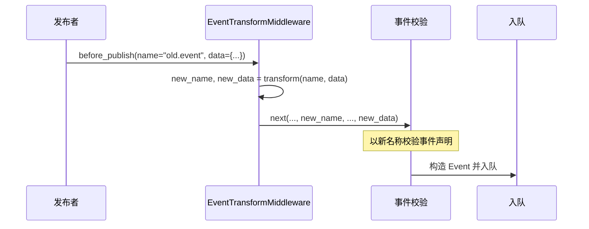

# EventTransformMiddleware 事件转换中间件文档

## 概述

`EventTransformMiddleware` 在 `before_publish` 阶段对事件名和/或负载数据进行转换。通过注入自定义转换函数，可以在事件入队前修改事件名、增删数据字段，而下游处理器无需感知原始事件格式。

框架提供了三个工厂函数简化常见转换场景：

- `make_rename_transform` — 事件重命名
- `make_field_inject_transform` — 字段注入
- `make_field_redact_transform` — 字段脱敏

---

## 使用场景

- **事件重命名**：将旧版事件名映射到新版，平滑迁移。
- **数据脱敏**：在持久化或跨系统传输前移除敏感字段（密码、令牌等）。
- **数据补全**：自动注入通用字段（`trace_id`、`timestamp`、`env`）。
- **协议适配**：将外部系统的事件格式转换为内部格式。
- **A/B 测试**：按条件将事件路由到不同的目标事件名。

---

## 函数签名

### EventTransformMiddleware

```python
TransformFunc = Callable[
    [str, Dict[str, Any] | BaseModel | None],
    tuple[str, Dict[str, Any] | BaseModel | None],
]

class EventTransformMiddleware(Middleware):
    def __init__(self, transform: TransformFunc) -> None
```

| 参数 | 类型 | 说明 |
| - | - | - |
| `transform` | `TransformFunc` | 转换函数，签名为 `(name, data) -> (new_name, new_data)`。 |

### make_rename_transform

```python
def make_rename_transform(mapping: Dict[str, str]) -> TransformFunc
```

| 参数 | 类型 | 说明 |
| - | - | - |
| `mapping` | `Dict[str, str]` | 旧事件名 → 新事件名的映射字典。未匹配的事件名保持原样。 |

### make_field_inject_transform

```python
def make_field_inject_transform(**static_fields: Any) -> TransformFunc
```

| 参数 | 类型 | 说明 |
| - | - | - |
| `**static_fields` | `Any` | 要注入的静态字段键值对。若与已有字段重名，注入值优先生效。 |

> **注意**：仅对 `dict` 类型的 `data` 生效。若 `data` 为 `BaseModel` 或 `None`，不做修改。

### make_field_redact_transform

```python
def make_field_redact_transform(
    *fields: str,
    replacement: str = '***',
) -> TransformFunc
```

| 参数 | 类型 | 说明 |
| - | - | - |
| `*fields` | `str` | 需要脱敏的字段名。 |
| `replacement` | `str` | 替换文本，默认 `"***"`。 |

---

## 工作流程



关键点：

1. 转换发生在事件声明校验**之后**、构造 Event **之前**。
2. 转换后的新事件名必须在 `EventRegistry` 中已注册，否则后续校验会失败。
3. 转换函数**不应抛出异常**。如需条件转换，在函数内部处理边界情况。

---

## 使用示例

### 事件重命名

```python
from event_bus.templates.middlewares import (
    EventTransformMiddleware,
    make_rename_transform,
)

transform = make_rename_transform({
    "user.created.v1": "user.created",
    "order.placed.v1": "order.placed",
})
mw = EventTransformMiddleware(transform)
```

### 字段注入

```python
from event_bus.templates.middlewares import (
    EventTransformMiddleware,
    make_field_inject_transform,
)

# 自动为所有事件注入 trace_id 和环境标识
transform = make_field_inject_transform(
    trace_id="abc-123",
    env="production",
    version="2.0.0",
)
mw = EventTransformMiddleware(transform)
```

发布 `{"user_id": 42}` → 实际负载变为 `{"trace_id": "abc-123", "env": "production", "version": "2.0.0", "user_id": 42}`。

### 字段脱敏

```python
from event_bus.templates.middlewares import (
    EventTransformMiddleware,
    make_field_redact_transform,
)

# 自动脱敏敏感字段
transform = make_field_redact_transform("password", "token", "secret")
mw = EventTransformMiddleware(transform)
```

发布 `{"username": "alice", "password": "s3cret!"}` → 实际负载变为 `{"username": "alice", "password": "***"}`。

### 自定义转换函数

```python
def add_prefix(name: str, data) -> tuple:
    # 不对系统事件添加前缀
    if name.startswith("event_bus."):
        return name, data
    return f"prefix.{name}", data

mw = EventTransformMiddleware(add_prefix)
```

---

## 注意事项

1. **目标事件必须注册**：转换后的新事件名必须在 `EventRegistry` 中存在，否则发布会因事件未声明而失败。
2. **转换顺序**：多个转换中间件按注册顺序依次执行，后面的转换基于前面的结果。
3. **字段注入仅对 dict 生效**：`make_field_inject_transform` 和 `make_field_redact_transform` 仅处理 `dict` 类型的负载。若负载是 `BaseModel` 实例，需编写自定义转换函数。
4. **幂等性**：确保转换函数对同一输入多次调用结果一致，避免意外副作用。
5. **与 EventBlockMiddleware 组合**：转换后可配合事件屏蔽中间件，按新名称过滤事件（参见 `event_block.md`）。

---

## 完整示例

参见 `tests/templates/middlewares/event_transform_test.py`

其中包含了事件重命名、字段注入、字段脱敏、自定义转换等场景的测试用例。
