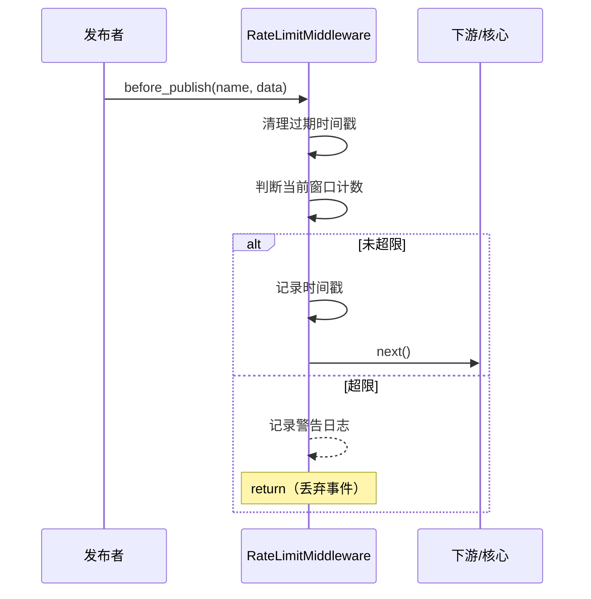

# RateLimitMiddleware 速率限制中间件文档

## 概述

`RateLimitMiddleware` 是一个基于**滑动窗口**的速率限制中间件。它在 `before_publish` 阶段对事件发布频率进行控制，超过限制时自动丢弃事件（不调用 `next`），并记录警告日志。

支持两种限流模式：

- **全局限流**（`per_event=False`）：所有事件共享一个窗口。
- **按事件名限流**（`per_event=True`）：每种事件名独立计数。

纯内存实现，无外部依赖。

---

## 使用场景

- **防刷保护**：限制客户端高频发布事件。
- **资源保护**：防止下游处理器被突发流量压垮。
- **降级策略**：在系统负载过高时自动丢弃非关键事件。
- **测试控制**：在测试环境中精确控制事件流速率。

---

## 函数签名

```python
class RateLimitMiddleware(Middleware):
    def __init__(
        self,
        max_requests: int = 100,
        window_seconds: float = 1.0,
        per_event: bool = False,
    ) -> None
```

| 参数 | 类型 | 说明 |
| - | - | - |
| `max_requests` | `int` | 时间窗口内允许的最大请求数，默认 `100`。 |
| `window_seconds` | `float` | 滑动窗口大小（秒），默认 `1.0`。 |
| `per_event` | `bool` | 若为 `True`，按事件名独立计数；否则全局共享一个窗口，默认 `False`。 |

### 属性

| 属性 | 类型 | 说明 |
| - | - | - |
| `current_rate` | `Dict[str, int]` | 返回当前各窗口的请求计数快照。键为事件名（或 `"__global__"`），值为当前窗口内的请求数。 |

---

## 工作流程



1. `before_publish` 被调用时，先清理窗口外（早于 `now - window_seconds`）的时间戳。
2. 判断当前窗口内的请求数是否 ≥ `max_requests`。
3. 若未超限：记录当前时间戳，调用 `next` 继续发布流程。
4. 若超限：记录 `WARNING` 日志，直接返回（不调用 `next`），事件被丢弃。

---

## 使用示例

### 全局限流

所有事件共享每秒 100 次的限制：

```python
from event_bus.templates.middlewares import RateLimitMiddleware
from event_bus import MiddlewareChain

mw = RateLimitMiddleware(max_requests=100, window_seconds=1.0)
chain = MiddlewareChain()
chain.add(mw)
```

### 按事件名限流

不同事件名独立计数，互不影响：

```python
# mw.ping 每秒最多 50 次，user.login 每秒最多 10 次
mw = RateLimitMiddleware(
    max_requests=50,
    window_seconds=1.0,
    per_event=True,
)
```

### 查询当前速率

```python
# 查看各窗口的当前请求数
print(mw.current_rate)
# 输出示例：{'__global__': 42} 或 {'mw.ping': 5, 'user.login': 2}
```

### 与其他中间件组合

先限流再转换，确保转换逻辑只对通过限流的事件生效：

```python
from event_bus.templates.middlewares import (
    RateLimitMiddleware,
    EventTransformMiddleware,
    make_field_inject_transform,
)

chain = MiddlewareChain()
chain.add(RateLimitMiddleware(max_requests=10, window_seconds=1.0))
chain.add(EventTransformMiddleware(
    make_field_inject_transform(source="trusted")
))
# 执行顺序：限流 → 注入字段 → 核心发布
```

---

## 注意事项

1. **丢弃无声**：超限事件被静默丢弃，不会抛出异常。业务侧如需感知丢弃，可监听日志或自定义中间件。
2. **窗口精度**：基于 `time.monotonic()`，不受系统时间调整影响。
3. **并发安全**：内部使用 `asyncio.Lock` 保护计数操作。
4. **内存占用**：每个窗口最多保留 `max_requests` 个时间戳，内存开销可控。
5. **不含 `on_publish_error`**：速率限制发生在入队前，不会触发错误钩子。

---

## 完整示例

参见 `tests/templates/middlewares/rate_limit_test.py`

其中包含了全局限流、按事件名限流、限流后组合转换等场景的测试用例。
