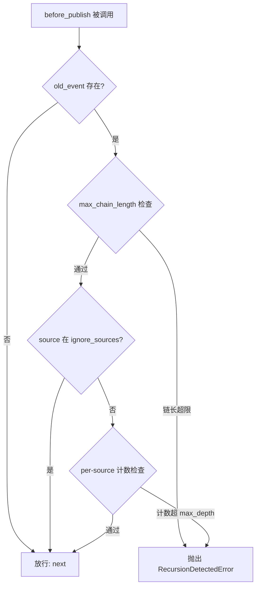

# RecursionGuardMiddleware 递归防护中间件文档

## 概述

`RecursionGuardMiddleware` 提供**双重检测**机制，防止事件发布出现无限递归（包括自递归和互递归）。所有检测在 `before_publish` 阶段执行，在入队前即可拦截，不消耗队列资源。

当检测到递归时，抛出 `RecursionDetectedError`（继承自 `RuntimeError`），该异常会触发 `on_publish_error` 通知链中所有中间件。

---

## 使用场景

- **自递归防护**：Handler A 处理事件时又发布了同名事件，导致自身被反复调用。
- **互递归防护**：Handler A 发布事件触发 Handler B，Handler B 又发布事件触发 Handler A，形成循环。
- **链式调用保护**：限制事件链的最大长度，防止业务逻辑异常导致链无限增长。

---

## 函数签名

### RecursionGuardMiddleware

```python
class RecursionGuardMiddleware(Middleware):
    def __init__(
        self,
        max_depth: int = 3,
        max_chain_length: Optional[int] = 50,
        ignore_sources: Optional[Set[str]] = None,
    ) -> None
```

| 参数 | 类型 | 说明 |
| - | - | - |
| `max_depth` | `int` | 同一 `source` 在事件链的 `sources` 中允许出现的最大次数，默认 `3`。 |
| `max_chain_length` | `Optional[int]` | 事件链绝对最大长度，默认 `50`。设为 `None` 禁用此层检测。 |
| `ignore_sources` | `Optional[Set[str]]` | 不参与 per-source 计数的发布者名称集合。不影响绝对链长检测。 |

### RecursionDetectedError

```python
class RecursionDetectedError(RuntimeError):
    """事件发布递归调用被检测并拦截。"""
```

---

## 双重检测机制



### 第一层：per-source 计数

同一 `source` 在事件链的 `sources` 列表中出现次数 ≥ `max_depth` 时拒绝。

**示例**：

```text
root(test) → Handler A 发布(system) → Handler B 发布(system) → Handler A 发布(system) ❌ 被拦截
```

`system` 在 `sources` 中出现了 3 次（默认 `max_depth=3`），第 4 次发布前被拦截。

### 第二层：绝对链长

事件链 `event_ids` 长度 > `max_chain_length` 时拒绝，无论各 source 计数如何。

**示例**：`max_depth=3` 时，K 个模块互递归可达 `3 × K` 轮。设 `max_chain_length=10` 可在此场景下提前拦截。

---

## 使用示例

### 基础防护

```python
from event_bus.templates.middlewares import RecursionGuardMiddleware
from event_bus import MiddlewareChain

# 默认配置：同一 source 最多出现 3 次，链长最多 50
mw = RecursionGuardMiddleware()
chain = MiddlewareChain()
chain.add(mw)
```

### 严格模式

```python
# 更严格的限制：同一 source 最多出现 2 次，链长最多 10
mw = RecursionGuardMiddleware(max_depth=2, max_chain_length=10)
```

### 忽略特定来源

```python
# 某些中间件或系统组件允许在链中多次出现
mw = RecursionGuardMiddleware(
    max_depth=3,
    ignore_sources={"LoggingMiddleware", "MetricsCollector"},
)
```

被忽略的 source 不参与 per-source 计数，但仍受绝对链长限制。

### 仅使用链长检测

```python
# 禁用 per-source 检测，仅靠链长上限防护
mw = RecursionGuardMiddleware(
    max_depth=0,            # 允许同一 source 无限出现
    max_chain_length=20,    # 但链长超过 20 时拦截
)
```

### 仅使用 per-source 检测

```python
# 禁用链长检测，仅靠 per-source 计数
mw = RecursionGuardMiddleware(
    max_depth=2,
    max_chain_length=None,  # 禁用绝对链长检测
)
```

---

## 递归场景详解

### 自递归

```text
Handler X 订阅 "order.updated"
  → 处理时发布 "order.updated"
    → Handler X 再次被调用
      → 又发布 "order.updated" ...
```

`max_depth=2` 可在此场景下第 3 次发布前拦截。

### 互递归

```text
Handler A 订阅 "event.a" → 处理时发布 "event.b"
Handler B 订阅 "event.b" → 处理时发布 "event.a"
```

Per-source 计数各为 2，不触发拦截。但链长会持续增长，`max_chain_length` 可在一定轮数后拦截。

### 链式传递（正常场景）

```text
Service A 发布 "data.received"
  → Service B 处理并发布 "data.validated"
    → Service C 处理并发布 "data.stored"
```

三个不同的 source，per-source 计数各为 1，链长为 3——正常通过。

---

## 注意事项

1. **根事件豁免**：`old_event` 为 `None` 的根事件始终放行，不进行任何检测。
2. **`ignore_sources` 仅影响第一层**：被忽略的 source 仍受绝对链长检测约束。
3. **异常传播**：`RecursionDetectedError` 会中断当前发布流程，并通过 `on_publish_error` 通知所有中间件。
4. **性能**：检测仅涉及列表遍历和计数，时间复杂度 O(n)，n 为当前链长。
5. **默认值**：`max_depth=3` 和 `max_chain_length=50` 适用于大多数场景。过于严格可能误杀正常的链式调用。

---

## 完整示例

参见 `tests/templates/middlewares/recursion_guard_test.py`

其中包含了正常链式发布、递归拦截、根事件豁免、忽略源、不同源互不干扰、绝对链长限制等场景的测试用例。
