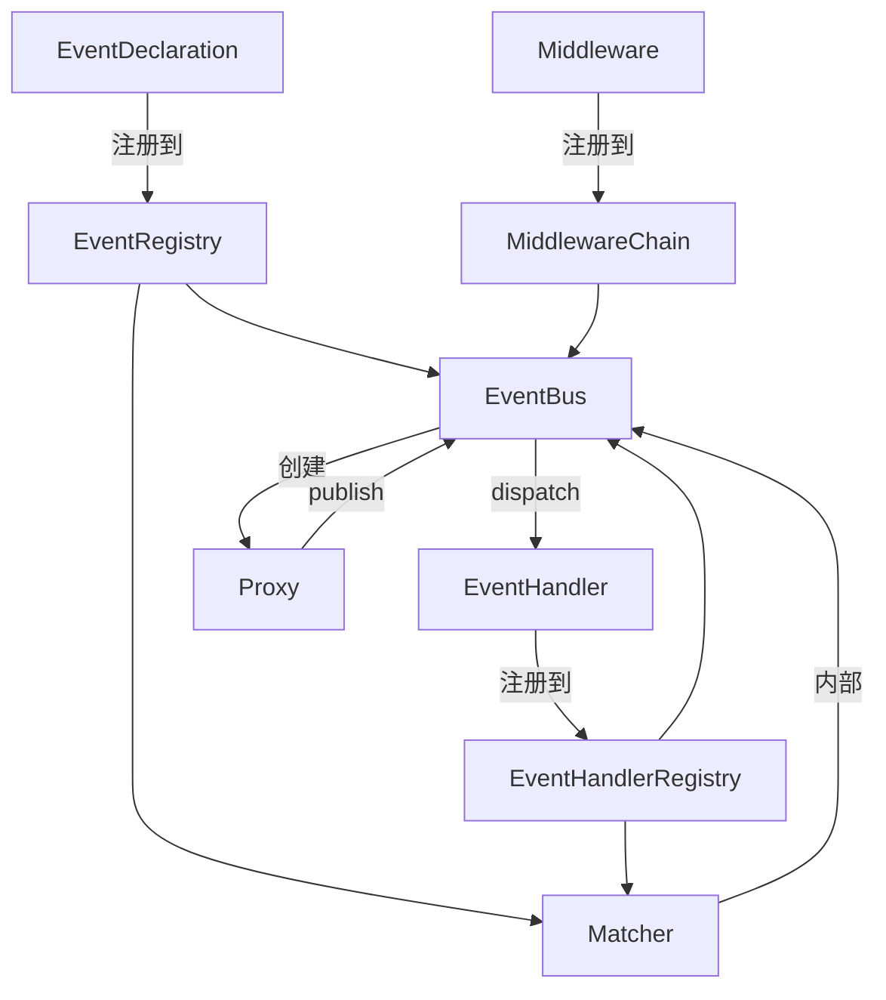

# EventBus 异步事件总线文档

## 概述

EventBus 是一个基于 asyncio 的轻量级事件总线，实现发布/订阅模式，用于在异步应用中解耦组件间的通信。它提供了强类型事件声明、正则表达式订阅、中间件管道、并发控制、超时保护及优雅停机等能力。

---

## 文档索引

| 文档 | 内容 |
| - | - |
| [event.md](event.md) | `Event` 运行时实例、`EventDeclaration` 事件声明、`EventRegistry` 注册表 |
| [handler.md](handler.md) | `EventHandler` 处理器基类、`EventHandlerRegistry` 处理器注册表 |
| [matcher.md](matcher.md) | `Matcher` 事件匹配器、预计算分派表、版本感知 |
| [bus.md](bus.md) | `EventBus` 事件总线、`Proxy` 代理、`ShutdownConfig` 停机配置、内置事件与异常 |
| [middleware.md](middleware.md) | `Middleware` 中间件基类、`MiddlewareChain` 责任链管理器、洋葱模型 |
| [templates/](templates/templates.md) | [高级模板总览](templates/templates.md)：`expect`、`request`、`pipe`、`register` 及内置中间件 |

---

## 核心组件关系



### 发布流程

```text
bus.proxy(source).publish(name, data)
  │
  ▼
before_publish 链 (中间件 1 → 2 → ... → 核心)
  │
  ├─ 校验 EventDeclaration
  ├─ 校验 payload (Pydantic)
  ├─ 构造 Event
  └─ 入队 → 触发 on_publish 链
       │
       ▼
    分发循环
       │
       ├─ Matcher.match(name)
       └─ create_task(handler_wrapper)
            ├─ semaphore (并发限制)
            ├─ asyncio.timeout
            └─ handler(bus, event)
```

---

## 快速开始

```python
import asyncio
from pydantic import BaseModel
from event_bus import EventBus, EventRegistry, EventHandlerRegistry
from event_bus import EventDeclaration, EventHandler

# 1. 声明负载
class MyPayload(BaseModel):
    message: str

# 2. 声明事件
class MyEvent(EventDeclaration):
    name = "my.event"
    payload_type = MyPayload

# 3. 实现处理器
class MyHandler(EventHandler):
    def __init__(self):
        super().__init__(subscriptions=["my.event"])

    async def handle(self, payload, bus_proxy, raw_event):
        print(f"Received: {payload.message}")

# 4. 组装
reg = EventRegistry()
reg.register(MyEvent)
h_reg = EventHandlerRegistry()
h_reg.register(MyHandler())

# 5. 运行
async def main():
    async with EventBus(reg, h_reg) as bus:
        await bus.proxy("cli").publish("my.event", {"message": "Hello"})
        await asyncio.sleep(0.1)

asyncio.run(main())
```

---

## 工作流程

1. **事件声明与注册** — 定义事件类型并注册到 `EventRegistry`，使总线识别合法事件及其负载结构。
2. **处理器订阅与注册** — 实现 `EventHandler` 并通过 `subscriptions`（支持正则）声明监听的事件模式，注册到 `EventHandlerRegistry`。
3. **启动总线与发布** — 通过 `EventBus.Proxy.publish()` 发布事件，自动完成负载校验、中间件管道处理并入队。
4. **事件分发与处理** — 调度循环从队列中取出事件，匹配订阅处理器并通过信号量控制并发执行。
5. **优雅停止** — 发布 `__shutdown__` 通知 → 拒绝新发布 → 排空队列 → 等待活跃任务完成。

---

## 关键特性

- **强类型负载校验**：发布时自动校验数据类型与结构，防止无效数据流入。
- **正则表达式订阅**：支持灵活的事件名匹配规则。
- **中间件管道**：洋葱模型的责任链，支持日志、校验、限流等横切关注点。
- **背压控制**：通过队列大小与并发信号量限制系统负载。
- **超时保护**：每个处理器可独立设置超时，避免单任务阻塞总线。
- **错误隔离**：单个处理器异常不会影响其他处理器的执行，异常信息通过内置错误事件统一上报。
- **优雅停机**：保证停止过程中已入队事件被完整处理，避免数据丢失。
- **可观测性**：提供活跃任务数、队列长度等监控指标。

---

## 内置事件

| 事件名 | 触发时机 | 负载类型 | 用途 |
| - | - | - | - |
| `event_bus.__shutdown__` | 总线开始停止时 | 无 | 通知处理器执行清理工作 |
| `event_bus.__task_error__` | 处理器执行失败时 | `TaskErrorPayload` | 错误监控与告警 |

---

## 注意事项

- 所有 `EventHandler.handle` 实现**不应包含阻塞操作**，必须使用异步 I/O。
- 事件负载模型应继承 `pydantic.BaseModel` 以确保数据验证。
- 处理器中可通过 `bus_proxy.publish` 发布新事件，形成处理链，总线会自动追踪来源。
- 停止过程中发布新事件将抛出 `BusShuttingDown` 异常，调用方需妥善处理。
