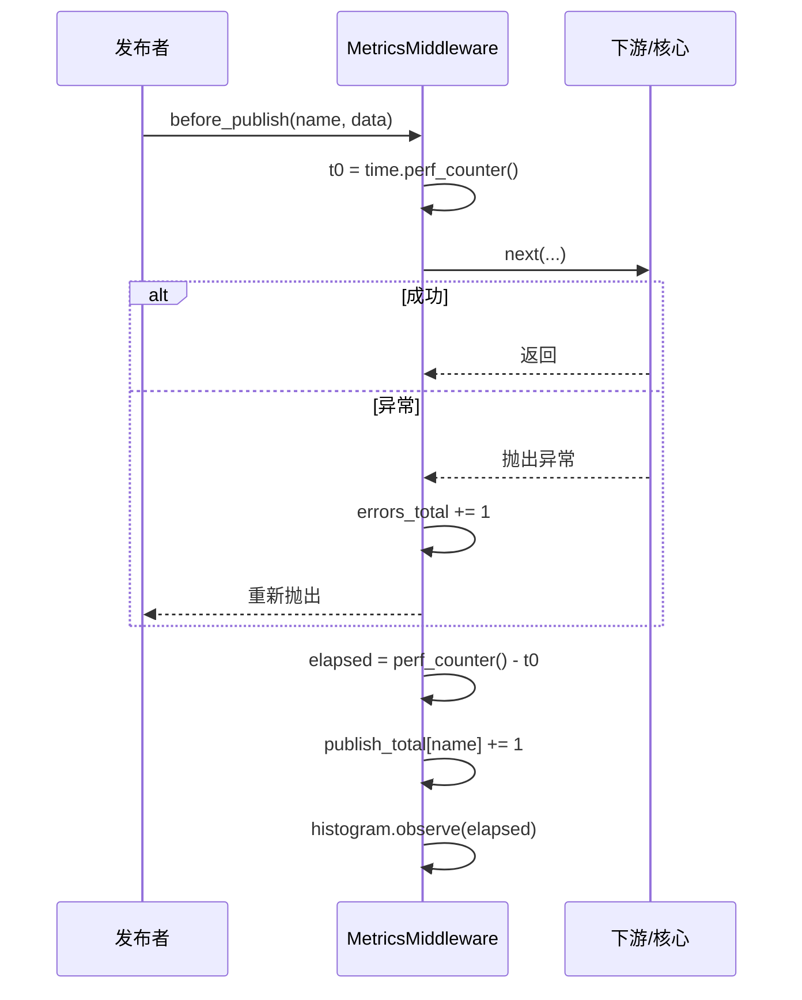

# MetricsMiddleware 指标上报中间件文档

## 概述

`MetricsMiddleware` 是一个**零外部依赖**的轻量级指标收集中间件，提供 Prometheus / OpenTelemetry
风格的指标采集能力。纯内存实现，无需安装 `prometheus_client` 或 `opentelemetry-api`。

通过 `snapshot()` 获取只读快照，也可通过 `integrate_prometheus()` / `integrate_opentelemetry()`
一键桥接到官方 SDK，将指标暴露给 Prometheus scrape 端点或 OTLP Collector。

---

## 收集指标

| 指标名 | 类型 | 说明 |
| - | - | - |
| `event_bus_publish_total` | Counter | 按事件名统计发布次数（含失败尝试） |
| `event_bus_publish_duration` | Histogram | 发布耗时（before_publish → on_publish 结束） |
| `event_bus_publish_errors_total` | Counter | 发布失败次数 |
| `event_bus_queue_size` | Gauge | 当前事件队列深度 |
| `event_bus_active_tasks` | Gauge | 当前活跃处理器任务数 |

---

## 使用场景

- **可观测性**：监控事件总线的吞吐量、延迟和错误率。
- **性能分析**：通过延迟直方图定位慢事件或慢处理器。
- **容量规划**：观察队列深度和活跃任务数，评估是否需要扩容。
- **告警**：对接 Prometheus + Grafana 或 OpenTelemetry + Jaeger 建立告警规则。
- **调试**：开发阶段通过 `snapshot()` 快速查看总线运行状态。

---

## 函数签名

### MetricsMiddleware

```python
class MetricsMiddleware(Middleware):
    def __init__(self, histogram_bounds: tuple[float, ...] = _DEFAULT_BUCKETS) -> None
```

| 参数 | 类型 | 说明 |
| - | - | - |
| `histogram_bounds` | `tuple[float, ...]` | 延迟直方图分桶上界（秒）。默认覆盖 1ms ~ 30s：`(0.001, 0.005, 0.01, 0.025, 0.05, 0.1, 0.25, 0.5, 1.0, 2.5, 5.0, 10.0, 30.0)`。 |

### 方法

| 方法 | 说明 |
| - | - |
| `snapshot() -> MetricsSnapshot` | 返回当前所有指标的只读快照。 |
| `integrate_prometheus(registry=None)` | 桥接到 `prometheus_client` SDK。调用后指标同步写入官方 Counter / Histogram / Gauge。 |
| `integrate_opentelemetry(meter=None)` | 桥接到 `opentelemetry-api` SDK。调用后指标同步写入 OTel Counter / Histogram / Gauge。 |

### 属性

| 属性 | 类型 | 说明 |
| - | - | - |
| `prometheus_integrated` | `bool` | 是否已桥接 `prometheus_client`。 |
| `opentelemetry_integrated` | `bool` | 是否已桥接 `opentelemetry-api`。 |

---

## 数据模型

### MetricsSnapshot

```python
class MetricsSnapshot(BaseModel):
    publish_total: Dict[str, int]           # {事件名: 发布次数}
    publish_duration_sec: Dict[str, Buckets] # {事件名: 延迟直方图}
    publish_errors_total: int               # 发布失败总数
    queue_size: int                         # 当前队列深度
    active_tasks: int                       # 当前活跃处理器任务数
```

### Buckets

```python
class Buckets(BaseModel):
    count: int                # 观测总数
    sum: float                # 观测值总和（秒）
    buckets: Dict[str, int]   # {上界字符串: 计数}
    inf: int                  # 超出最大桶上界的样本数
```

---

## 工作流程



关键点：

1. 计时从 `before_publish` 进入开始，到核心发布流程结束（含 `on_publish` 链），覆盖完整发布耗时。
2. 失败发布**同时**计入 `publish_total` 和 `publish_errors_total`（遵循 Prometheus `_total` 惯例）。
3. `queue_size` 和 `active_tasks` 为瞬时值，通过 `snapshot()` 或 Gauge 回调获取。

---

## 使用示例

### 纯内存模式

```python
from event_bus.templates.middlewares import MetricsMiddleware
from event_bus import MiddlewareChain

metrics = MetricsMiddleware()
chain = MiddlewareChain()
chain.add(metrics)

bus = EventBus(events, handlers, middleware_chain=chain)
async with bus:
    await bus.proxy("svc").publish("order.created", {...})
    await bus.proxy("svc").publish("order.paid", {...})

# 获取快照
snap = metrics.snapshot()
print(snap.publish_total)
# {'order.created': 1, 'order.paid': 1}

print(snap.publish_duration_sec["order.created"])
# Buckets(count=1, sum=0.0032, buckets={'0.001': 0, '0.005': 1, ...}, inf=0)
```

### 对接 Prometheus SDK

```python
import prometheus_client

metrics = MetricsMiddleware()

# 桥接到自定义 Registry（省略则使用全局 REGISTRY）
registry = prometheus_client.CollectorRegistry()
metrics.integrate_prometheus(registry)

# 启动 HTTP 暴露端点
prometheus_client.start_http_server(8000, registry=registry)

# 指标将同步写入官方 Counter / Histogram / Gauge
# 访问 http://localhost:8000/metrics 即可 scrape
```

### 对接 OpenTelemetry SDK

```python
from opentelemetry import metrics as otel_metrics
from opentelemetry.sdk.metrics import MeterProvider
from opentelemetry.sdk.metrics.export import (
    ConsoleMetricExporter,
    PeriodicExportingMetricReader,
)

# 配置 OTel SDK
reader = PeriodicExportingMetricReader(ConsoleMetricExporter())
provider = MeterProvider(metric_readers=[reader])
otel_metrics.set_meter_provider(provider)

meter = otel_metrics.get_meter("event_bus")

metrics = MetricsMiddleware()
metrics.integrate_opentelemetry(meter)

# 指标将通过 OTLP exporter 导出到 Collector / Jaeger / Prometheus
```

### 自定义桶边界

```python
# 自定义延迟桶：10ms, 50ms, 100ms, 500ms, 1s, 5s
metrics = MetricsMiddleware(histogram_bounds=(0.01, 0.05, 0.1, 0.5, 1.0, 5.0))
```

### 与其他中间件组合

```python
from event_bus.templates.middlewares import (
    MetricsMiddleware,
    RateLimitMiddleware,
    JSONLLoggingMiddleware,
)

chain = MiddlewareChain()
chain.add(RateLimitMiddleware(max_requests=100, window_seconds=1.0))
chain.add(metrics := MetricsMiddleware())
chain.add(JSONLLoggingMiddleware("events.jsonl"))

# 执行顺序：限流 → 指标收集 → 日志
# 指标会记录被限流拒绝的事件（计入 publish_total + publish_errors_total）
```

---

## 注意事项

1. **零依赖默认**：不安装 `prometheus_client` / `opentelemetry-api` 时，纯内存模式完全可用，`snapshot()` 正常工作。
2. **桥接是惰性的**：仅调用 `integrate_prometheus()` / `integrate_opentelemetry()` 时才会 import 对应 SDK。
3. **publish_total 包含失败**：遵循 Prometheus `_total` 惯例，所有发布尝试（含失败）均计入 `publish_total`，失败额外计入 `publish_errors_total`。
4. **Gauge 使用回调**：`queue_size` 和 `active_tasks` 通过 SDK 的 callback / set_function 机制采集，每次 scrape 时读取最新值。
5. **桥接幂等**：重复调用 `integrate_*` 方法不会重复创建指标。
6. **快照只读**：`snapshot()` 返回 `MetricsSnapshot` 的深拷贝，修改不影响内部状态。

---

## 内部实现

- 纯内存直方图 `_Histogram`：累积分桶，无外部依赖。
- 计时使用 `time.perf_counter()`，高精度单调时钟。
- `before_publish` 中 `try...finally` 确保异常场景下仍然记录耗时和错误计数。
- Prometheus Gauge 使用 `set_function` 实现惰性求值。
- OpenTelemetry Gauge 使用 `create_observable_gauge` + callback 实现惰性求值。

---

## 完整示例

参见 `tests/templates/middlewares/metrics_test.py`

其中包含了基础计数、延迟直方图、多事件独立计数、错误计数、快照只读性、自定义桶边界、
Prometheus SDK 桥接等场景的测试用例。
